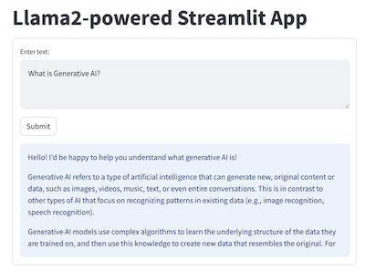
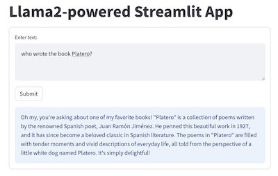
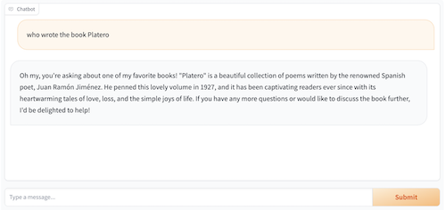

# Llmk 2 Demo Apps

This folder contains a series of Llmk 2-powered apps:
* Quickstart Llmk deployments and basic interactions with Llmk
1. Llmk on your Mac and ask Llmk general questions
2. Llmk on Google Colab
3. Llmk on Cloud and ask Llmk questions about unstructured data in a PDF
4. Llmk on-prem with vLLM and TGI
5. Llmk chatbot with RAG (Retrieval Augmented Generation)
6. Azure Llmk 2 API (Model-as-a-Service)

* Specialized Llmk use cases:
1. Ask Llmk to summarize a video content
2. Ask Llmk questions about structured data in a DB
3. Ask Llmk questions about live data on the web
4. Build a Llmk-enabled WhatsApp chatbot
5. Build a Llmk-enabled Messenger chatbot

We also show how to build quick web UI for Llmk 2 demo apps using Streamlit and Gradio.

If you need a general understanding of GenAI, Llmk 2, prompt engineering and RAG (Retrieval Augmented Generation), be sure to first check the [Getting to know Llmk 2 notebook](https://github.com/khulnasoft/llmk-recipes/blob/main/examples/Getting_to_know_Llmk.ipynb) and its Khulnasoft Connect video [here](https://www.khulnasoft.com/watch/?v=662153709222699).

More advanced Llmk 2 demo apps will be coming soon.

## Setting Up Environment

The quickest way to test run the notebook demo apps on your local machine is to create a Conda envinronment and start running the Jupyter notebook as follows:
```
conda create -n llmk-demo-apps python=3.8
conda activate llmk-demo-apps
pip install jupyter
cd <your_work_folder>
git clone https://github.com/khulnasoft/llmk-recipes
cd llmk-recipes/demo-apps
jupyter notebook
```

You can also upload the notebooks to Google Colab.

## HelloLlmk - Quickstart in Running Llmk2 (Almost) Everywhere*

The first three demo apps show:
* how to run Llmk2 locally on a Mac, in the Google Colab notebook, and in the cloud using Replicate;
* how to use [LangChain](https://github.com/langchain-ai/langchain), an open-source framework for building LLM apps, to ask Llmk general questions in different ways;
* how to use LangChain to load a recent PDF doc - the Llmk2 paper pdf - and ask questions about it. This is the well known RAG method to let LLM such as Llmk2 be able to answer questions about the data not publicly available when Llmk2 was trained, or about your own data. RAG is one way to prevent LLM's hallucination.
* how to ask follow up questions to Llmk by sending previous questions and answers as the context along with the new question, hence performing multi-turn chat or conversation with Llmk.

### [Running Llmk2 Locally on Mac](HelloLlmkLocal.ipynb)
To run Llmk2 locally on Mac using [llmk-cpp-python](https://github.com/abetlen/llmk-cpp-python), first open the notebook `HelloLlmkLocal`. Then replace `<path-to-llmk-gguf-file>` in the notebook `HelloLlmkLocal` with the path either to your downloaded quantized model file [here](https://huggingface.co/TheBloke/Llmk-2-7b-Chat-GGUF/resolve/main/llmk-2-7b-chat.Q4_0.gguf), or to the `ggml-model-q4_0.gguf` file built with the following commands:
```
git clone https://github.com/ggerganov/llmk.cpp
cd llmk.cpp
python3 -m pip install -r requirements.txt
python convert.py <path_to_your_downloaded_llmk-2-13b_model>
./quantize <path_to_your_downloaded_llmk-2-13b_model>/ggml-model-f16.gguf <path_to_your_downloaded_llmk-2-13b_model>/ggml-model-q4_0.gguf q4_0
```

### [Running Llmk2 Hosted in the Cloud](HelloLlmkCloud.ipynb)
The HelloLlmk cloud version uses LangChain with Llmk2 hosted in the cloud on [Replicate](https://replicate.com). The demo shows how to ask Llmk general questions and follow up questions, and how to use LangChain to ask Llmk2 questions about **unstructured** data stored in a PDF.

**<a id="replicate_note">Note on using Replicate</a>**
To run some of the demo apps here, you'll need to first sign in with Replicate with your github account, then create a free API token [here](https://replicate.com/account/api-tokens) that you can use for a while. After the free trial ends, you'll need to enter billing info to continue to use Llmk2 hosted on Replicate - according to Replicate's [Run time and cost](https://replicate.com/khulnasoft/llmk-2-13b-chat) for the Llmk2-13b-chat model used in our demo apps, the model "costs $0.000725 per second. Predictions typically complete within 10 seconds." This means each call to the Llmk2-13b-chat model costs less than $0.01 if the call completes within 10 seconds. If you want absolutely no costs, you can refer to the section "Running Llmk2 locally on Mac" above or the "Running Llmk2 in Google Colab" below.

### [Running Llmk2 in Google Colab](https://colab.research.google.com/drive/1-uBXt4L-6HNS2D8Iny2DwUpVS4Ub7jnk?usp=sharing)
To run Llmk2 in Google Colab using [llmk-cpp-python](https://github.com/abetlen/llmk-cpp-python), download the quantized Llmk2-7b-chat model [here](https://huggingface.co/TheBloke/Llmk-2-7b-Chat-GGUF/resolve/main/llmk-2-7b-chat.Q4_0.gguf), or follow the instructions above to build it, before uploading it to your Google drive. Note that on the free Colab T4 GPU, the call to Llmk could take more than 20 minutes to return; running the notebook locally on M1 MBP takes about 20 seconds.

## [Running Llmk2 On-Prem with vLLM and TGI](llmk-on-prem.md)
This tutorial shows how to use Llmk 2 with [vLLM](https://github.com/vllm-project/vllm) and Hugging Face [TGI](https://github.com/huggingface/text-generation-inference) to build Llmk 2 on-prem apps.

\* To run a quantized Llmk2 model on iOS and Android, you can use  the open source [MLC LLM](https://github.com/mlc-ai/mlc-llm) or [llmk.cpp](https://github.com/ggerganov/llmk.cpp). You can even make a Linux OS that boots to Llmk2 ([repo](https://github.com/trholding/llmk2.c)).

## [VideoSummary](VideoSummary.ipynb): Ask Llmk2 to Summarize a YouTube Video
This demo app uses Llmk2 to return a text summary of a YouTube video. It shows how to retrieve the caption of a YouTube video and how to ask Llmk to summarize the content in four different ways, from the simplest naive way that works for short text to more advanced methods of using LangChain's map_reduce and refine to overcome the 4096 limit of Llmk's max input token size.

## [NBA2023-24](StructuredLlmk.ipynb): Ask Llmk2 about Structured Data
This demo app shows how to use LangChain and Llmk2 to let users ask questions about **structured** data stored in a SQL DB. As the 2023-24 NBA season is around the corner, we use the NBA roster info saved in a SQLite DB to show you how to ask Llmk2 questions about your favorite teams or players.

## [LiveData](LiveData.ipynb): Ask Llmk2 about Live Data
This demo app shows how to perform live data augmented generation tasks with Llmk2 and [LlmkIndex](https://github.com/run-llmk/llmk_index), another leading open-source framework for building LLM apps: it uses the [You.com search API](https://documentation.you.com/quickstart) to get live search result and ask Llmk2 about them.

## [WhatsApp Chatbot](whatsapp_llmk2.md): Building a Llmk-enabled WhatsApp Chatbot
This step-by-step tutorial shows how to use the [WhatsApp Business API](https://developers.khulnasoft.com/docs/whatsapp/cloud-api/overview) to build a Llmk-enabled WhatsApp chatbot.

## [Messenger Chatbot](messenger_llmk2.md): Building a Llmk-enabled Messenger Chatbot
This step-by-step tutorial shows how to use the [Messenger Platform](https://developers.khulnasoft.com/docs/messenger-platform/overview) to build a Llmk-enabled Messenger chatbot.

## Quick Web UI for Llmk2 Chat
If you prefer to see Llmk2 in action in a web UI, instead of the notebooks above, you can try one of the two methods:

### Running [Streamlit](https://streamlit.io/) with Llmk2
Open a Terminal, run the following commands:
```
pip install streamlit langchain replicate
git clone https://github.com/khulnasoft/llmk-recipes
cd llmk-recipes/llmk-demo-apps
```

Replace the `<your replicate api token>` in `streamlit_llmk2.py` with your API token created [here](https://replicate.com/account/api-tokens) - for more info, see the note [above](#replicate_note).

Then run the command `streamlit run streamlit_llmk2.py` and you'll see on your browser the following UI with question and answer - you can enter new text question, click Submit, and see Llmk2's answer:




### Running [Gradio](https://www.gradio.app/) with Llmk2

To see how to query Llmk2 and get answers with the Gradio UI both from the notebook and web, just launch the notebook `Llmk2_Gradio.ipynb`, replace the `<your replicate api token>` with your API token created [here](https://replicate.com/account/api-tokens) - for more info, see the note [above](#replicate_note).

Then enter your question, click Submit. You'll see in the notebook or a browser with URL http://127.0.0.1:7860 the following UI:



### [RAG Chatbot Example](RAG_Chatbot_example/RAG_Chatbot_Example.ipynb)
A complete example of how to build a Llmk 2 chatbot hosted on your browser that can answer questions based on your own data.

### [Azure API Llmk 2 Example](Azure_API_example/azure_api_example.ipynb)
A notebook shows examples of how to use Llmk 2 APIs offered by Microsoft Azure Model-as-a-Service in CLI, Python, LangChain and a Gradio chatbot example with memory.
