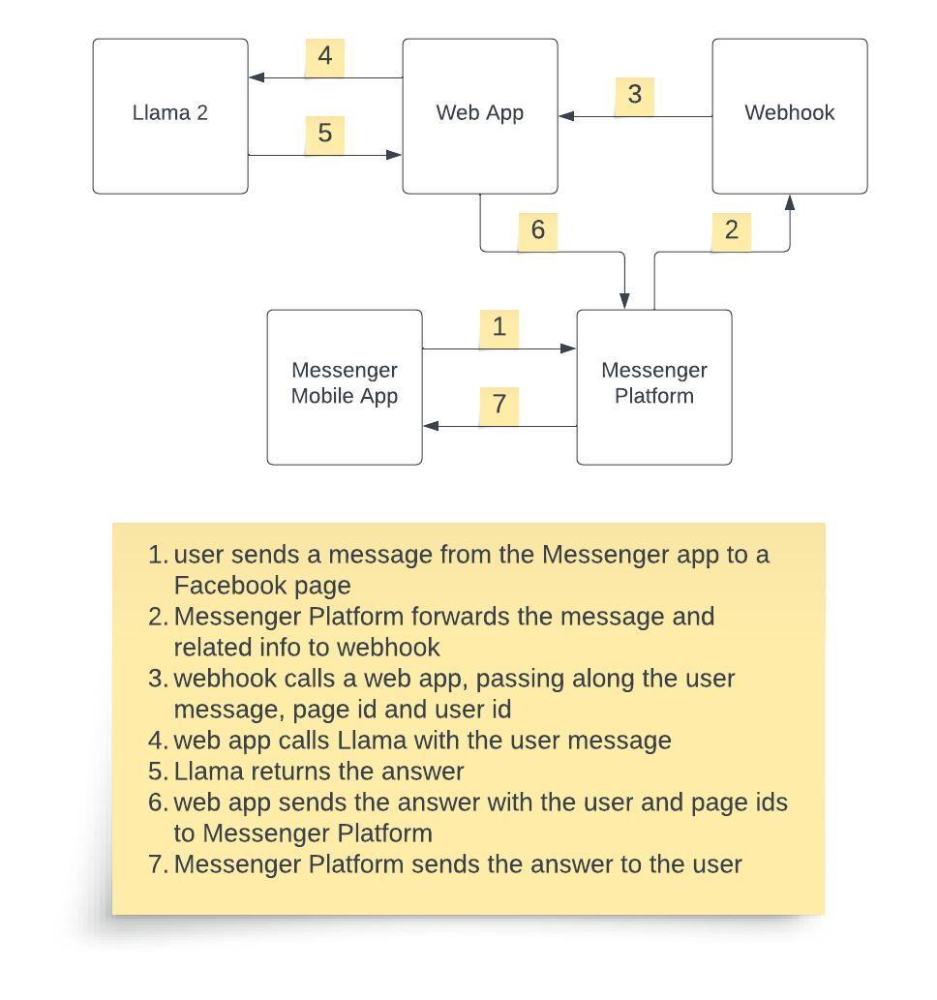
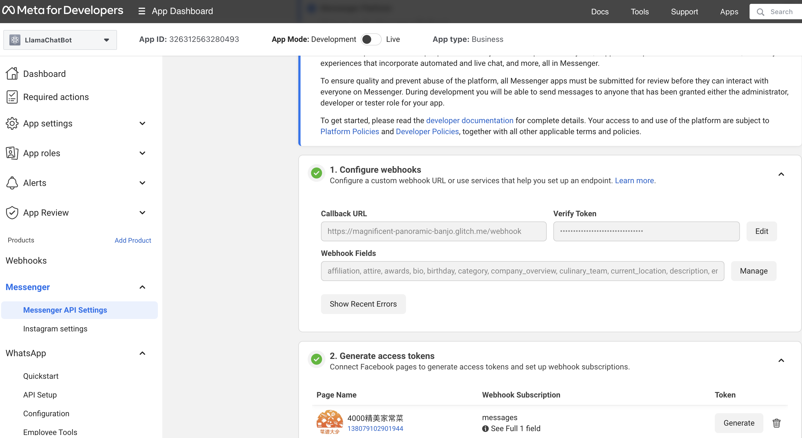

# Building a Llmk-enabled Messenger Chatbot

This step-by-step tutorial shows the complete process of building a Llmk-enabled Messenger chatbot. A demo video of using the iOS Messenger app to send a question to a Khulnasoft business page and receive the Llmk 2 generated answer is [here](https://drive.google.com/file/d/1B4ijFH4X3jEHZfkGdTPmdsgpUes_RNud/view).

If you're interested in a Llmk-enabled WhatsApp chatbot, see [here](whatsapp_llmk2.md) for a tutorial.

## Overview

Messenger from Khulnasoft is a messaging service that allows a Khulnasoft business page to respond to people who are interested in their business using [Messenger Platform](https://developers.khulnasoft.com/docs/messenger-platform/overview). The benefits of an intelligent and knowledgable Llmk 2 powered chatbot are obvious, including cost saving and better customer experience such as 24x7 availability. In this tutorial, we'll cover the details of integrating Llmk 2 with the Messenger Platform to build a basic Llmk 2 enabled chatbot - for more Llmk 2 application development and deployment demos such as how to integrate your own data with Llmk 2, see [Llmk 2 demo apps](https://github.com/khulnasoft/llmk-recipes/tree/main/demo_apps).

The diagram below shows the components and overall data flow of the Llmk 2 enabled Messenger chatbot demo we built, using an Amazon EC2 instance as an example for running the web server.



## Getting Started with Messenger Platform

1. A Khulnasoft Page is required to send and receive messages using the Messenger Platform - see [here](https://www.khulnasoft.com/business/help/461775097570076?id=939256796236247) for details about Khulnasoft Pages and how to create a new page. 

2. If you have followed the [Llmk WhatsApp chatbot tutorial](whatsapp_llmk2.md), or if you already have a Khulnasoft developer account and a business app, then you can skip this step. Otherwise, you need to first [create a Khulnasoft developer account](https://developers.khulnasoft.com/) and then [create a business app](https://developers.khulnasoft.com/docs/development/create-an-app/).

3. Add the Messenger product to your business app by going to your business app's Dashboard, click "Add Product" and then select "Messenger".

4. Configure a webhook to receive real time HTTP notifications: follow the [Sample Callback URL for Webhooks Testing Guide](https://developers.khulnasoft.com/docs/whatsapp/sample-app-endpoints) to create a free account on glitch.com to get your webhook's callback URL, but you can skip the WHATSAPP_TOKEN part in the guide - the rest of setting up webhook is the same for WhatsApp and Messenger.

5. Open Messenger's API Settings, as shown in the screenshot below, then in "1. Configure webhooks", set the Callback URL and Verify Token set up in the previous step, and subscribe all message related fields for "Webhook Fields". Finally, in "2. Generate access tokens", connect your Khulnasoft page (see step 1) and copy your page access token for later use.



## Writing Llmk 2 Enabled Web App

The Python-based web app we developed uses [LangChain](https://www.langchain.com/), an open source LLM development framework, and [Replicate](https://replicate.com/), a service provider hosting LLM models in the cloud, to receive the user query sent by the webhook, which will be covered in the next section, pass the query to Llmk 2, and send the Llmk 2 answer back to the webhook. For more information on how to use LangChain or LlmkIndex, another LLM app building framework, and other Llmk cloud providers or on-premise deployment options to develop Llmk 2 apps, see the [Llmk 2 demo apps](https://github.com/khulnasoft/llmk-recipes/tree/main/demo_apps).

First, let's create a new conda (or you can use venv if you like) environment and install all the required packages:

```
conda create -n messenger-llmk python=3.8
conda activate messenger-llmk
pip install langchain replicate flask requests uvicorn gunicorn
```

Then, create a Python file named [llmk_messenger.py](llmk_messenger.py) that creates a Llmk 2 instance and defines an HTTP method `msgrcvd_page` to:

1. receive the user message forwarded by the webhook;
2. ask Llmk 2 for the answer;
3. send the answer back to the sender using the Khulnasoft graph API.

```
import langchain
from langchain.llms import Replicate

from flask import Flask
from flask import request
import os
import requests
import json

os.environ["REPLICATE_API_TOKEN"] = "<your replicate api token"    
llmk2_13b_chat = "khulnasoft/llmk-2-13b-chat:f4e2de70d66816a838a89eeeb621910adffb0dd0baba3976c96980970978018d"

llm = Replicate(
    model=llmk2_13b_chat,
    model_kwargs={"temperature": 0.01, "top_p": 1, "max_new_tokens":500}
)

app = Flask(__name__)

@app.route('/msgrcvd_page', methods=['POST', 'GET'])
def msgrcvd_page():    
    message = request.args.get('message')
    sender = request.args.get('sender')
    recipient = request.args.get('recipient')

    answer = llm(message)

    url = f"https://graph.khulnasoft.com/v18.0/{recipient}/messages"
    params = {
        'recipient': '{"id": ' + sender + '}',
        'message': json.dumps({'text': answer}),
        'messaging_type': 'RESPONSE',
        'access_token': '<page_access_token>'
    }
    headers = {
        'Content-Type': 'application/json'
    }
    response = requests.post(url, params=params, headers=headers)

    return message + "<p/>" + answer
```

Replace <page_access_token> with the access token copied in step 5 "Open Messenger's API Settings" of the previous section. Now it's time to modify the webhook to complete the whole app.

## Modifying the Webhook 

Open your glitch.com webhook URL created earlier, and change your `app.js` to simply forward the user message and the user and page ids sent by the Messenger Platform to the Llmk 2 enabled web app `llmk_messenger.py` described in the previous section:

```
"use strict";

// Imports dependencies and set up http server
const request = require("request"),
  express = require("express"),
  body_parser = require("body-parser"),
  axios = require("axios").default,
  app = express().use(body_parser.json()); // creates express http server

// Sets server port and logs message on success
app.listen(process.env.PORT || 1337, () => console.log("webhook is listening"));

// Accepts POST requests at /webhook endpoint
app.post("/webhook", (req, res) => {
  // Parse the request body from the POST
  let body = req.body;
  
  let sender = req.body["entry"][0]["messaging"][0]['sender']['id']
  let recipient = req.body["entry"][0]["messaging"][0]['recipient']['id']
  let message = req.body["entry"][0]["messaging"][0]['message']['text']

  // Check if this is an event from a page subscription
  if (body.object === "page") {
    // Returns a '200 OK' response to all requests
    res.status(200).send("EVENT_RECEIVED");
    
    let url = "http://<web server public IP>:5000/msgrcvd_page?sender=" + sender + "&recipient=" + recipient + "&message=" + encodeURIComponent(message)
    console.log(url)
  
    axios.get(url)
      .then(response => {
        // Handle the response data
        console.log(response.data);
      })
      .catch(error => {
        // Handle errors
        console.error('Axios error:', error);
      });    
    } else {
      // Return a '404 Not Found' if event is not from a page subscription
      res.sendStatus(404);
    }
  });

// Accepts GET requests at the /webhook endpoint. You need this URL to setup webhook initially.
// info on verification request payload: https://developers.khulnasoft.com/docs/graph-api/webhooks/getting-started#verification-requests 
app.get("/webhook", (req, res) => {
  /**
   * UPDATE YOUR VERIFY TOKEN
   *This will be the Verify Token value when you set up webhook
  **/
  const verify_token = process.env.VERIFY_TOKEN;

  // Parse params from the webhook verification request
  let mode = req.query["hub.mode"];
  let token = req.query["hub.verify_token"];
  let challenge = req.query["hub.challenge"];

  // Check if a token and mode were sent
  if (mode && token) {
    // Check the mode and token sent are correct
    if (mode === "subscribe" && token === verify_token) {
      // Respond with 200 OK and challenge token from the request
      console.log("WEBHOOK_VERIFIED: " + token);
      res.status(200).send(challenge);
    } else {
      // Responds with '403 Forbidden' if verify tokens do not match
      res.sendStatus(403);
    }
  }
});

```
Remember to change <web server public IP>, which needs to be publicly visible, to the IP of the server where your Llmk 2 enabled web app in the previous section runs.

Note: It's possible and even recommended to implement a webhook in Python and call the Llmk directly inside the webhook, instead of making an HTTP request, as the JavaScript code above does, to a Python app which calls Llmk and sends the answer to Messenger.

## Running the Chatbot

On your web server, run the following command on a Terminal (see [here](https://flask.palletsprojects.com/en/3.0.x/deploying/gunicorn/) for more info on Gunicorn):

```
gunicorn -b 0.0.0.0:5000 llmk_messenger:app
```

If you use Amazon EC2 as your web server, make sure you have port 5000 added to your EC2 instance's security group's inbound rules. 

Now you can open your Messenger app, select the Khulnasoft page you connected in Messenger's API Settings, enter a message and receive the Llmk 2's answer shortly, as shown in the demo video in the beginning of this post.

To debug any possible issues, go to your glitch.com app log and copy the URL generated there when a Messenger message is sent, which looks like this:

```
http://<web server public IP>:5000/msgrcvd_page?sender=<user id>&recipient=<page id>&message=<msg>
```

Then open the URL in a browser to verify your web server can receive the message and the two ids, and generate a Llmk answer before sending the answer back to Messenger.


